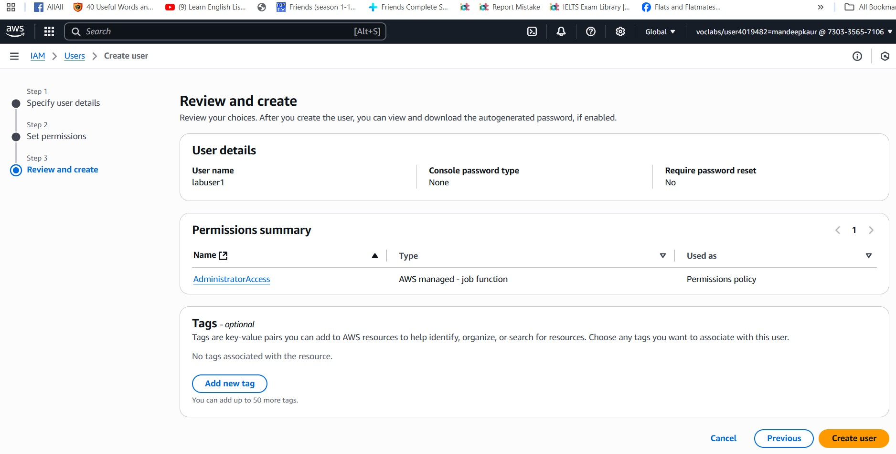
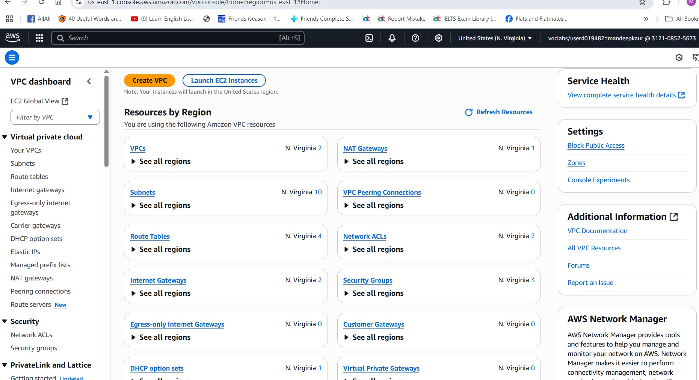
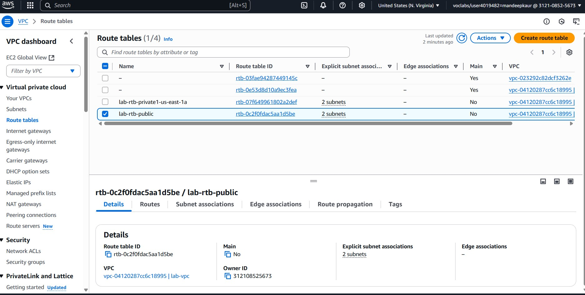
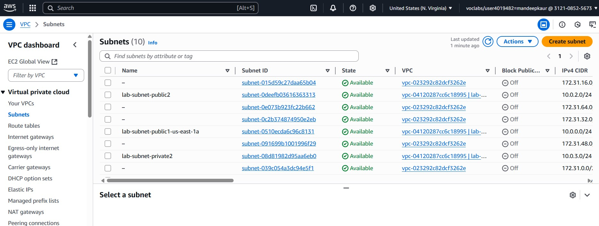
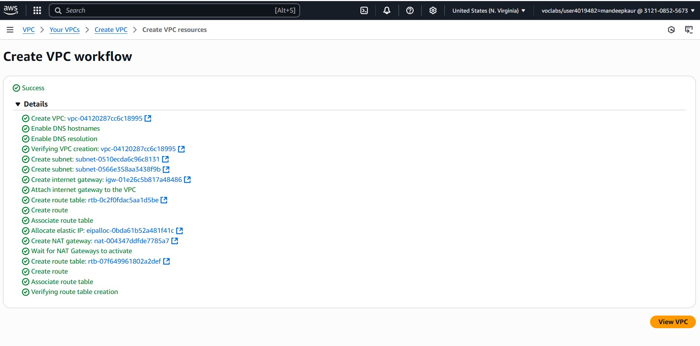
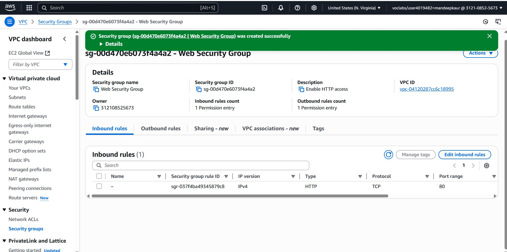
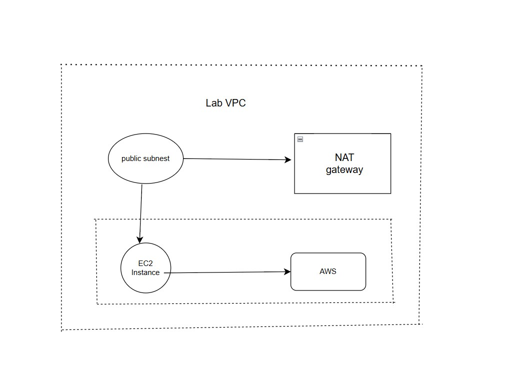

# Data Analytics Portfolio (BUSI 653)

## 📸 Lab Screenshots

### IAM Lab  

### VPC Lab  

### Route Table  

### Subnets  

### Create VPC  

### Web Server Launch  

## 🧠 Case Study  

## 🗂️ Architecture Diagram

---

##Learning Outcomes
The skills that I got by doing this AWS portfolio are:
Developer of IAM users and permissions creation and management
Planning out VPCs with safety and adjustable networks
Creating and setting up EC2 instances with the usage of web servers
The creation and the attachments of EBS volumes
AWS Lambda as the serverless workflow building tool
Deploying cloud infrastructure diagrams Structuring cloud infrastructure diagrams
